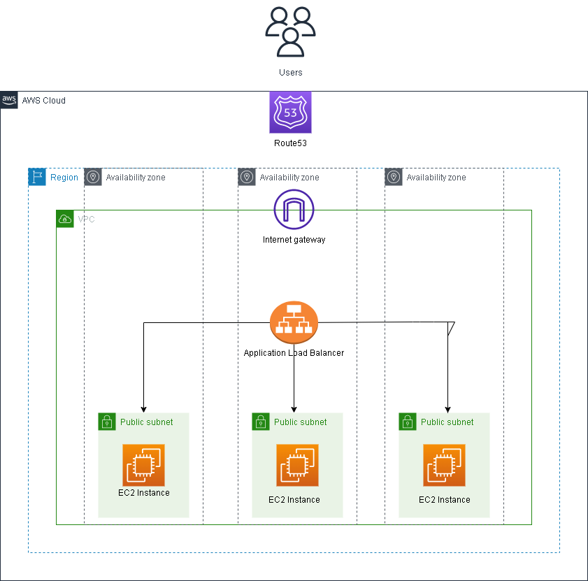
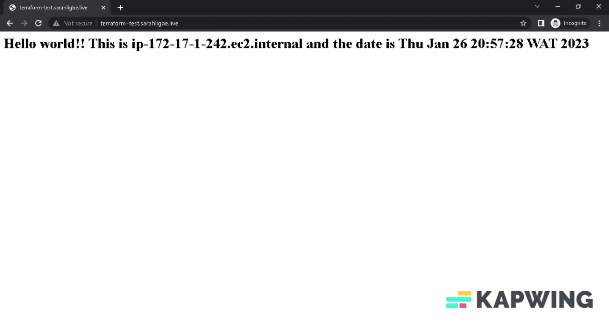

# Mini-project
## Use Terraform to create three EC2 instances and put them behind an Elastic Load Balancer,export the public IP addresses of the instances to a file called host-inventory, use AWS Route53 to set up a domain name and an A record for a subdomain that points to the ELB IP address, use Ansible to automate the configuration of the servers, including: Installing Apache, setting the time zone to Africa/Lagos, and displaying a simple HTML page that can be used to identify the servers.
  
Link to the [article](https://medium.com/@sarahligbe12/automating-infrastructure-deployment-and-configuration-management-with-terraform-and-ansible-on-aws-c98b8cee77f)

My `variables.tf` file and `terraform.tfvars` file do not contain any sensitive information, hence they were committed.  



### Pre-requisites
1. An AWS account with an IAM user with:

* AmazonVPCFullAccess
* AmazonEC2FullAccess
* AmazonRoute53FullAccess.  
The Access Key and Secret Access Key are required
2. Terraform installed.
3. Ansible installed.
4. A Linux OS (I used Ubuntu 20.04); Ansible does not run on Windows. You can use an EC2 instance, Vagrant, or a Mac.
5. A Name.com account; This is not necessary, but it is needed if you want to automate the process of adding the nameservers generated by Route53 to your Name.com domain (if this is your preferred domain provider).

You need to add your AWS Access Key and Secret Key as environment variables in your terminal. This way, you can safely store your Terraform code in a version control system without risking exposing sensitive information.

```bash
export AWS_ACCESS_KEY_ID="youraccesskey"
export AWS_SECRET_ACCESS_KEY="yoursecretkey"
```  

If you do not have a Name.com domain name you can remove the `namedotcom.tf` file.  
If you do have a Name.com domain (i.e., Name.com is your domain provider), set your token and username as environment variables
```bash
export TF_VAR_token="yourtokenname"
export TF_VAR_username="yourusername"
```  
You'll have to go to [https://www.name.com/account/settings/api](https://www.name.com/account/settings/api) to generate a token and whitelist your IP address as a security measure.  

Run:
```bash
terraform init
terraform plan
terraform apply --auto-approve
```  

#### Live site:

